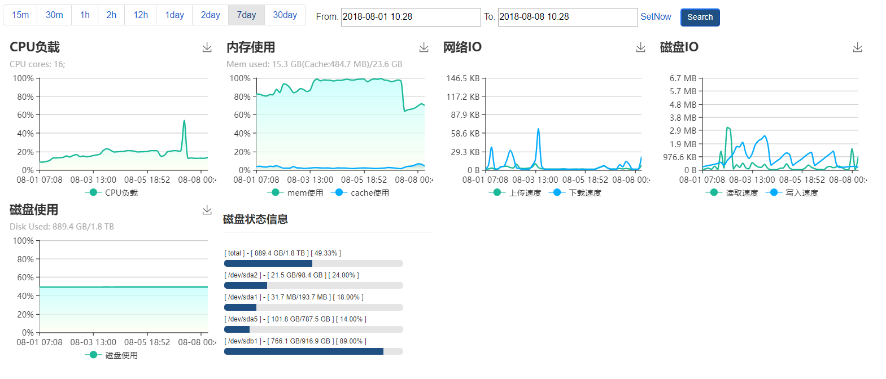

# 3.3.7 菜单集成

## 组件说明

菜单集成是指，将自己开发的微服务或第三方的UI页面（如Rest接口Swagger）嵌入到Skynet 控制台内，免除开发或运维人员需要记忆服务的访问地址。效果如下：




## 菜单汇报组件 

OnlineMenu，主要有以下3个接口

```java
public interface OnlineMenu extends AutoCloseable {

	/**
	 * 向在线菜单节点汇报
	 * 
	 * @param menuView
	 */
	void report(MenuView menuView);

	/**
	 * 获取菜单在线节点的数据
	 * 
	 * @return
	 */
	List<MenuView> getMenusList();

	/**
	 * 汇报菜单
	 * 
	 * <pre>
	 *    配置文件中IP地址和端口占位符   ${ipendport}
	 * </pre>
	 * 
	 * @param resourceFile
	 *            相对于 src/main/resources/目录下的菜单资源文件名 如 /speech.ui.menu.json
	 * @throws IOException
	 */
	void report(String resourceFile) throws IOException;
}
```

## 使用示例：

```java
@Autowired
private OnlineMenu onlineMenu;

@Override
public void init(AppContext appContext, Map<String, Object> params) throws Exception {
    //...
    this.onlineMenu.report("/static/ocr.menu.json");
    //...
}

@Override
public void close() throws Exception {
    //...
    this.onlineMenu.close();
    //..
}
```

ocr.memu.json 如下

```javascript
[
	{
		"index": 2,
		"mid": "ocr-service-ui",
		"name": "卷宗识别系统OCR",
		"icon": "file-text-o",
		"show": true,
		"menus": [
            {
                "index": 12,
                "mid": "ocr-web-api-swagger",
                "name": "服务接口Swagger视图",
                "icon": "exchange",
                "show": true,
                "url": "http://${ipendport}/swagger-ui.html"
            },
			{
                "index": 13,
                "mid": "ocr-web-api-jsondoc",
                "name": "服务接口JsonDoc视图",
                "icon": "exchange",
                "show": true,
                "url": "http://${ipendport}/jsondoc-ui.html?url=http://${ipendport}/jsondoc"
            }
		]
	}
]
```

> ${ipendport}  是当前服务的IP地址和端口 占位符号


